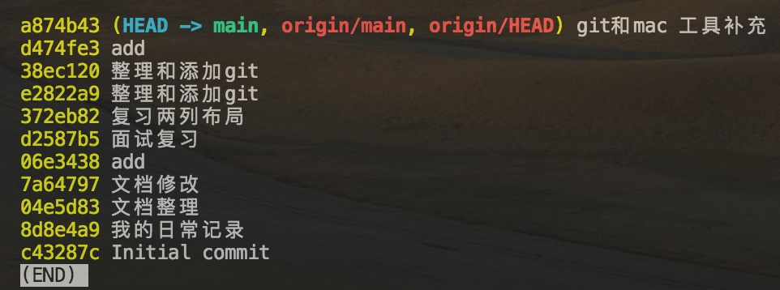

### 查看历史提交
`git log` —— 展示详情历史历史记录

`git log --pretty=oneline` —— 每个commit只展示一行，包含commitId+message

`git log --oneline` —— 每个commit只展示一行，包含commitId+message，commitId只展示部分；

`git reflog` —— 可以查看所有分支的操作记录（包括删除的commit和reset操作）